# Introduction
Our group will focus on the concept of credit card churning. It is the practice of applying for multiple credit cards for the sole purpose of earning welcome bonuses and other rewards and then canceling the cards before any annual fees and interest are charged. These credit cards are all of different types and are purchased within a short period of time. Even though it is not illegal, it is a practice that is looked down upon and sometimes, it may be against the terms and conditions of some cards, giving the issuer or the bank the right to confiscate the card and thus the rewards. You can read more about credit card churning [here](https://www.forbes.com/advisor/credit-cards/what-is-credit-card-churning/)

In the project, we have highlighted 2 major concerns relating to this practice: ethical implications and the effects of technology. We have adapted our dataset from Kaggle and also included information from secondary articles and websites.

# Exploratory Data Analysis

Our data analyzes churn rates that are influenced by demographic and financial variables in the dataset.

- The first [analysis](https://github.com/ubco-W2022T2-data301/project-group-group-20/blob/main/analysis/analysis1.ipynb) by Disha has an overview of factors that influence consumer behavior and the implementation of online and mobile banking. The graphs found that generally the youth is more comfortable with mobile banking and relatively richer people would not fall into the trap of this practice. 

- The second [analysis](https://github.com/ubco-W2022T2-data301/project-group-group-20/blob/main/analysis/analysis2.ipynb) by Vaishali revolves around the ethical implications and the effect on personal finances due to credit churning. The analysis includes graphs and new columns to determine the differences between an existing and churned customer. 

<b>Question 1: To what extent does advancements in technology affect consumer behaviour and what strategies are banks imposing to tackle the issue of retention using technology?</b>

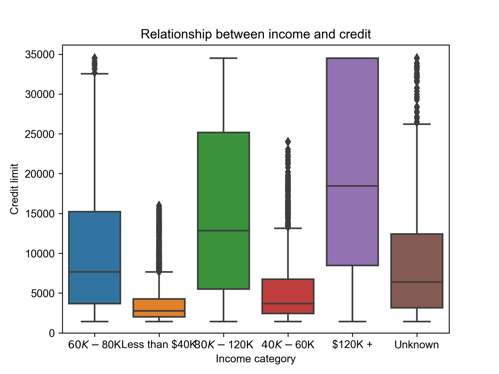

The box plot will provide information between income category and credit limit. One assumption taken in this boxplot is that there is a connection between the 2 variables. Consumers with higher incomes will have better credit limits as they are more likely to pay off the debt sooner. As shown in the graph below, we can see that predicition we had for higher incomes having credit limits holds true. The median in the boxplot is the highest for incomes greater than 120k. The outliers in the box plots shows credit limit for some consumers that is not appropriate for their income category. For example the category of 60k-80k has high credit limit outliers which can be due to consumers having shown bank loyalty and the bank knows and approves of the consumer's banking practices even though they have lower incomes.

| Index |Income Category |
| ----------- | ----------- |
| 0 | Less thsn 30k |
| 1 | 30k-49k ||
 2 | 50k-74k |
| 3 | Greater than 75k|

This [data](https://www.pewresearch.org/search/mobile+banking) is adapted from Pew research centre and is vital for the graph shwon below. here is still an increasing trend of people using mobile banking as income category increases. Red shaded area is a little larger than the rest. Since we have found that more consumers with a higher income category perform more online banking, we can draw a correlation between consumers and credit card churning based on their income category. The following graph shows the relationship between income category and consumer retention.Consumer retention is shown by the months on book column which shows the period of relationship with the bank.
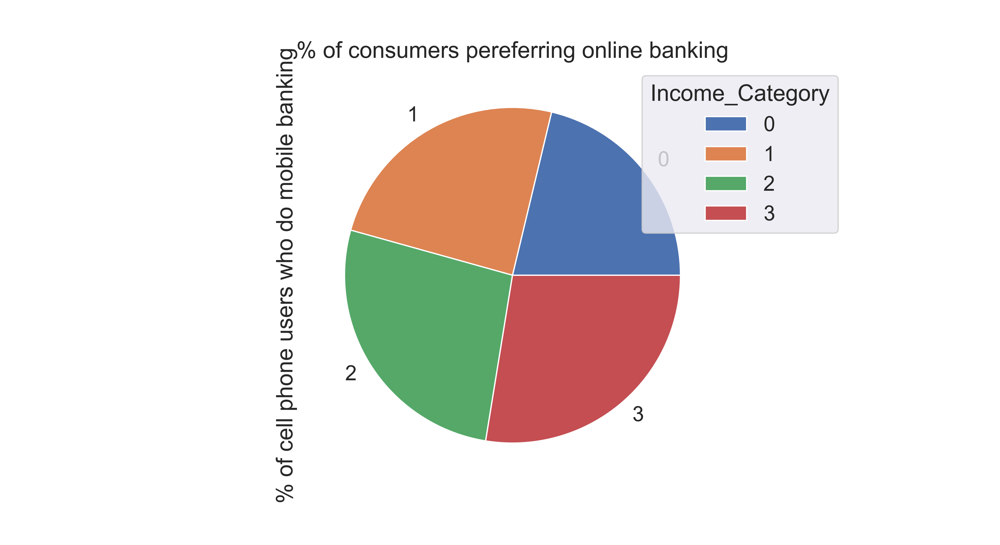

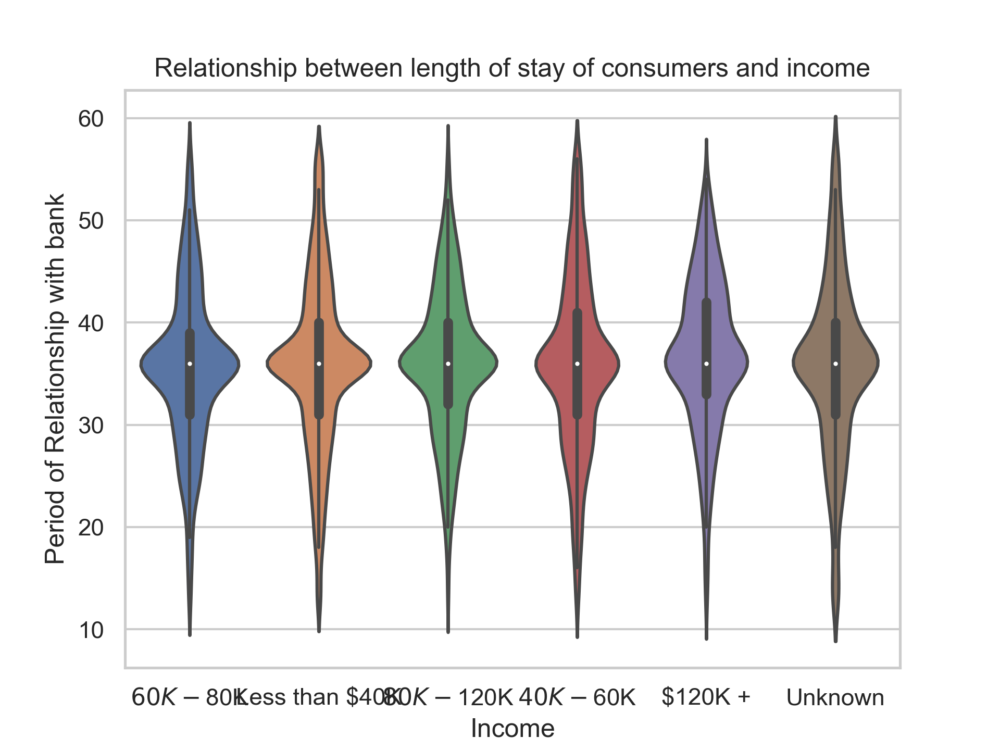

The graph above shows how advancements in online banking show that consumers have gotten more comfortable using their mobiles and internet instead of physically going to the bank. This also means it has gotten easier for consumers to access their accounts, making it easier to use the bonuses and reward programs. This shows a positive relationship between technology and credit card churning rates.

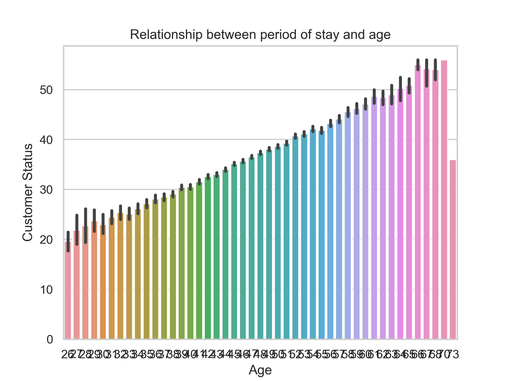
There is a relationship between months on book which is shown in the y axis and customer age shown in the x axis. This said relationship is positive as generally older people have already established financial histories with the bank and have more loyalty and trust.

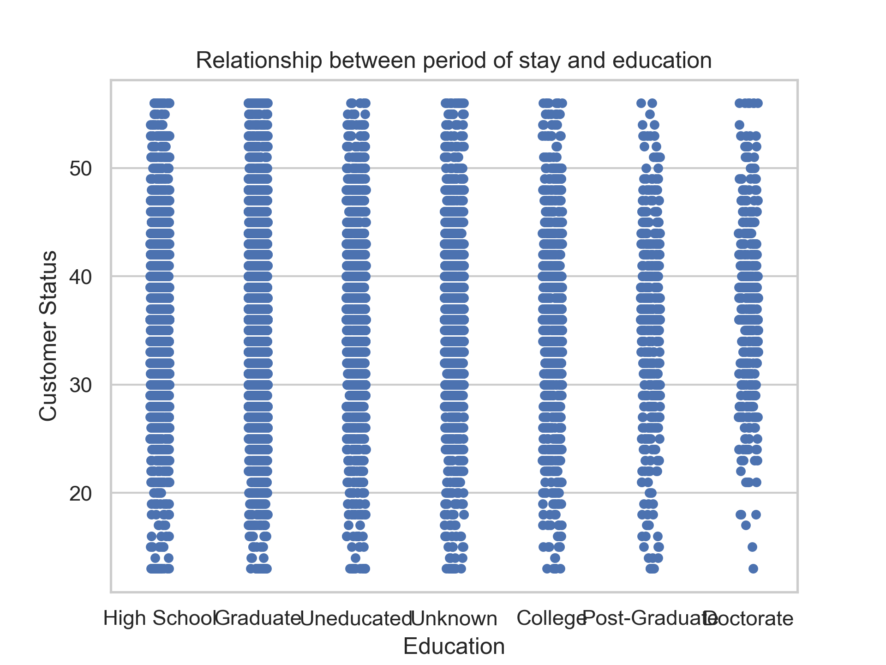
Here, the results are more of less the same. However,there is a positive relationship between the period of stay with a bank and education, to some extent. Generally, customers who have higher levels of education tend to have longer relationships with their banks. This is because individuals with higher levels of education are more likely to have stable incomes and financial goals, which can lead to a greater sense of trust and loyalty with their bank over time.

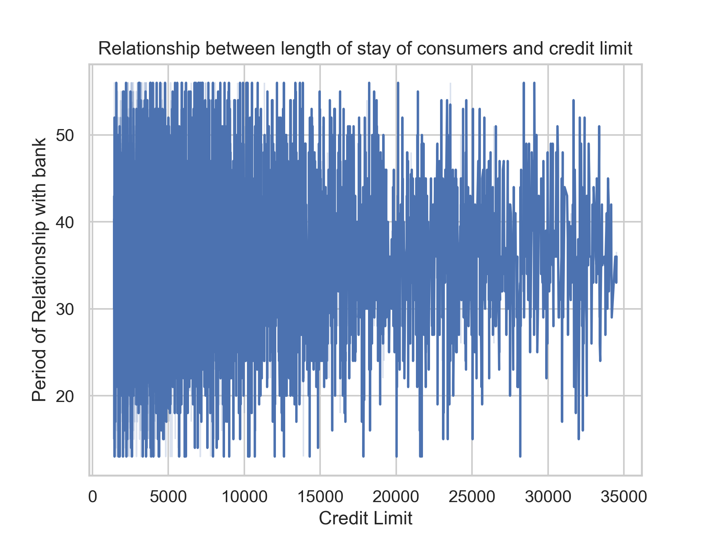
As can be seen, the fluctuations are decreasing as you move right. The area can also be seen to decrease. This can be due to the fact that there are many individual factors beyond the length of a customer's relationship with a bank that can also influence their credit limit such as income, employment status, and credit score can all play a role in determining a customer's creditworthiness and the amount of credit they can be approved for. 

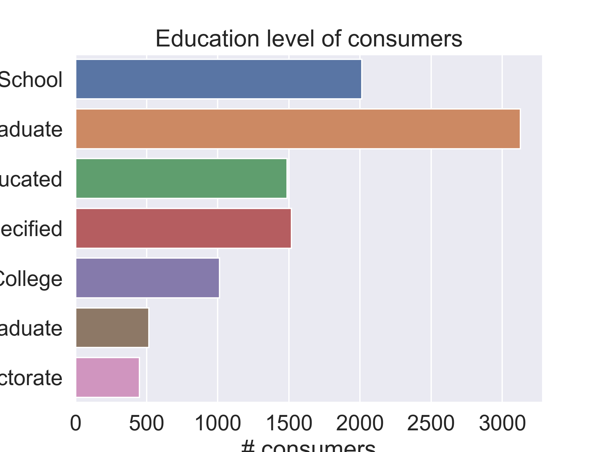
Lastly, this graph shows the types of education received by the variety of consumers in the bank. It can be noticed that graduate students account for a major part of the bank's clientum. 

<b>QUESTION 2: Are there any ethical implications of credit churning to personal finance? If so, in what unethical means do they affect our personal finances? </b>

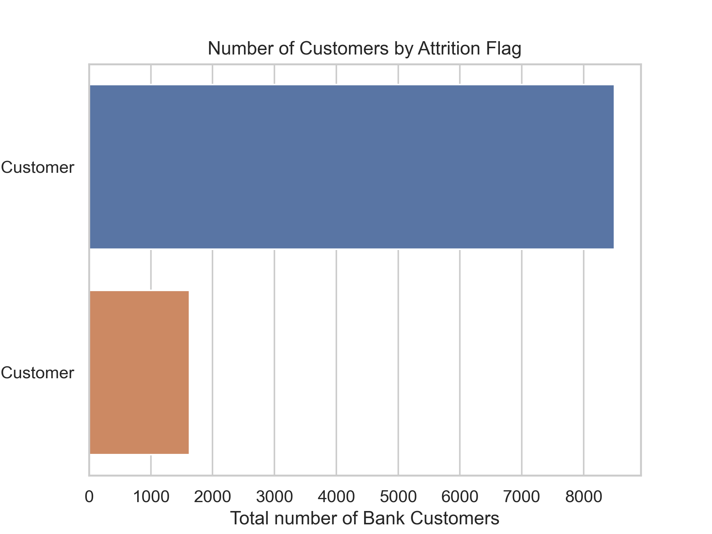

The plot above is a simple count plot to identify the differences in the two types of bank customers: attrited and existing. Attrited customers are those that have churned and existing customers are those that are still using the card services. 
Credit card churning is only a minor issue with banks so far. Thus, the plot below suggests that roughly 25% of their customers churn.

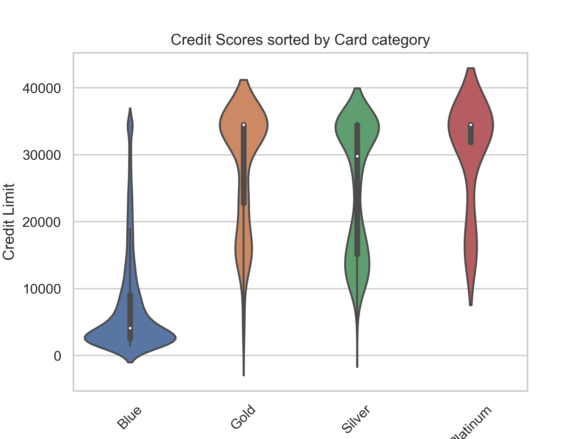

Furthermore, the second question required card category and credit limit to show the density of data using a violin plot. 
There are 4 types of card types in credit cards: blue, sliver, platinum and gold. Credit limit is the maximum the bank allows you to spend using the credit card. If the borrower exceeds their limit, fees and other charges will be applied. 

It is recommended to use a maximum 30% of your credit limit to maintain your credit score. 
    The plot: the white dot is the median, the top end and bottom end represents the maximum and minimum, the width represents the frequency (density). 
There is a higher frequency of customers in blue category. Platinum and Gold customers have the highest credit limits.

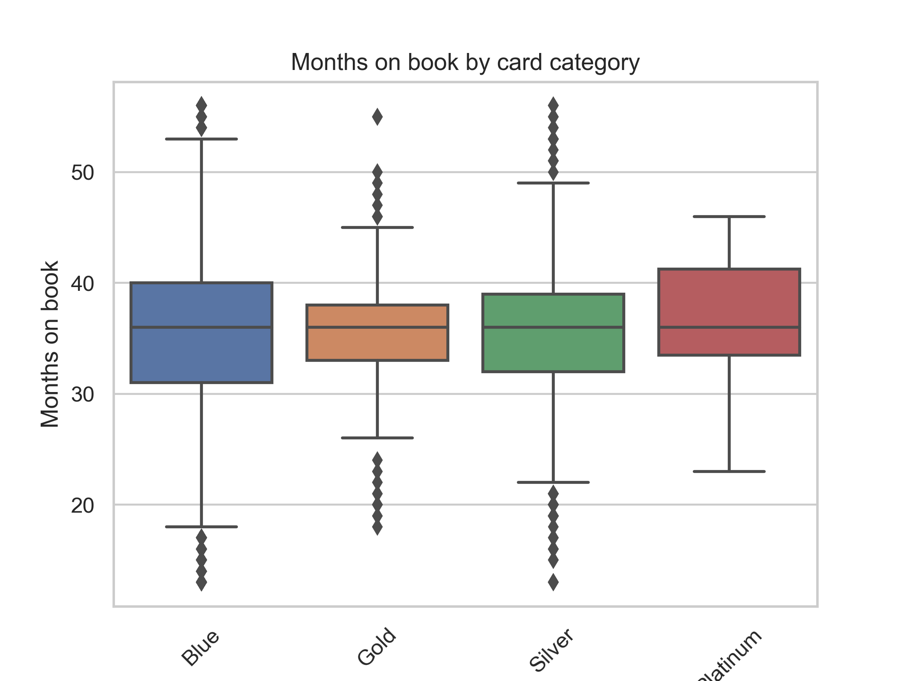

The box plot above represents the data between months on book and card category. 
I intend to analyze how long customers remain on the books based on each category. As you can see, customers in the blue category has a higher frequency of customers in this plot as well.

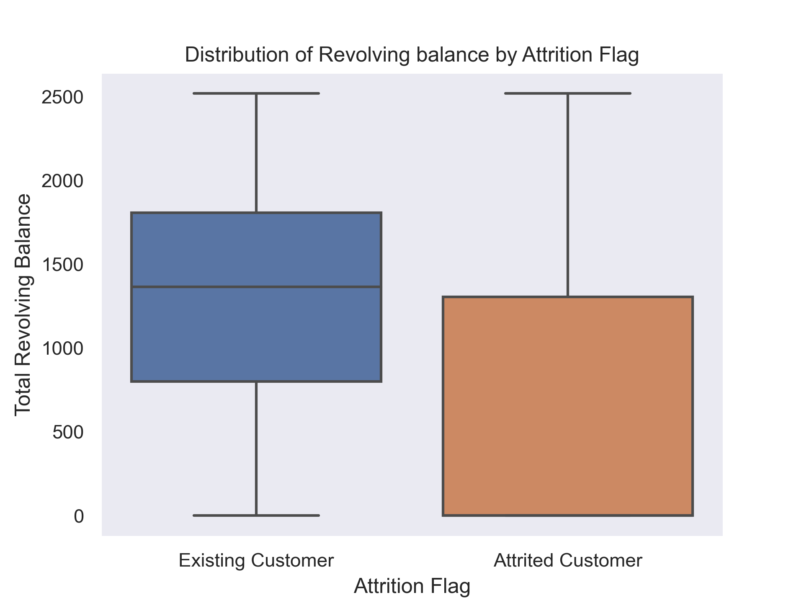
This box plot above explores the distribution of revolving balance between existing and attrited customer. The total Revolving balance is the amount of money the credit card holder owes to the credit card issuer. The balance carries over to the next billing cycle along with interest charged on the outstaning balance. As the plot suggests, existing customers have a higher mean revolving balance than attrited customers. However, the distrubution on revolving balance in attrited customers is much larger, data is more spread across, higher IQR, and higher variance in the numbers.

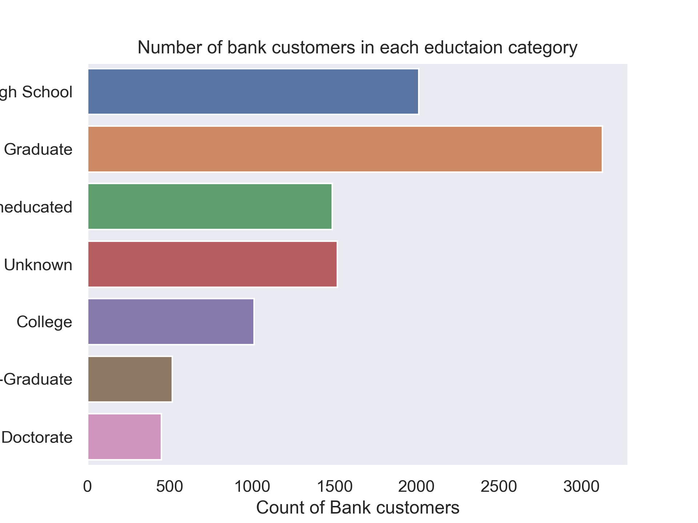
The count plot above displays the distribution of customer education level categories. This plot proves that there is a significant amount of high school and college students that are using credit card services, thus vulnerable to credit churning activities at present or in the future. This graph has been shown again due to its different impilcations repsective to the research question. 

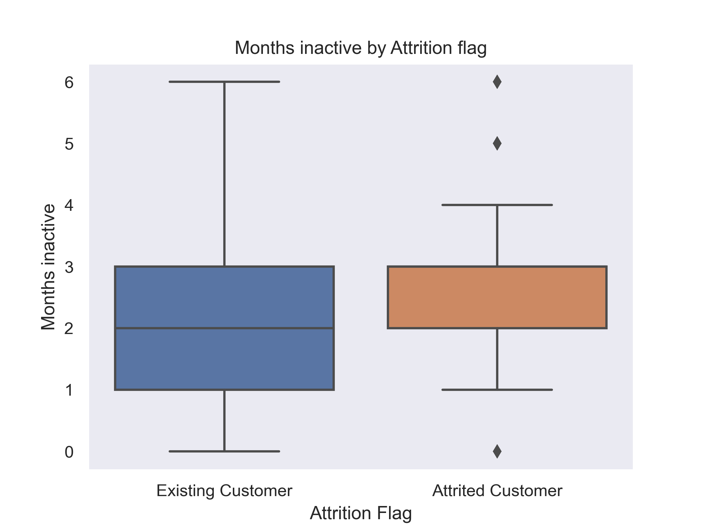
This box plot above intends to show the relationship between number of months inactive and attrition flag. Months inactive represents the time that has lapsed ever since the last used date of the credit card. Existing customers have a greater variation in this category, whereas attrited customers have remain inactive for a small period of time and cancel the service as soon they use the benefits and bonuses. Additionally, the attrited customer plot shows outliers in the distributions. This represents churned customers who have remained inactive for long periods of time after using their bonuses. As you can see, outliers are present only for attrited customers

# Summary
<b>First Question</b>

 Technology has made credit card churning easier by allowing consumers to sign up for rewards, compare card offers, and track rewards on their mobile devices. Banks have also utilized technology by using advanced algorithms and machines to identify potential churners and make it harder for consumers to churn their cards. Banks may make consumers wait a certain amount of time before issuing another card or limit the number of cards issued to a consumer at a time. They may also set filters and categories that must be met in order to issue credit cards, such as education and income thresholds, which discourage churning

<b>Second question</b>

For the second question,the graphs created above provide evidences for the differences between an existing customer and attrited customer. We intend to show how they differ from each other and what features make an attrited customer stand out of the dataset. The dataset will further elaborate to show us the various extremities in dataset where further proof is shown to justify the position of attrited customers. However, this dataset may show factors of a churned/churning customer for an existing customer. We only intend to focus on the different implications of credit churning on financial positions.

# Conclusion

- More consumers that are invested in mobile banking, more they are prone to churning.

- Smaller their relationship with bank, more likely they are to churn cards. This shows that a relatively loyal consumer would not participate in credit card churning

- As technology is advancing, banks should use technology iteself to solve this issue.

- credit churning is a common practice amongst bank customers

- it can damage your financial position as it increases your credit utilization score, which in turn lowers your credit score